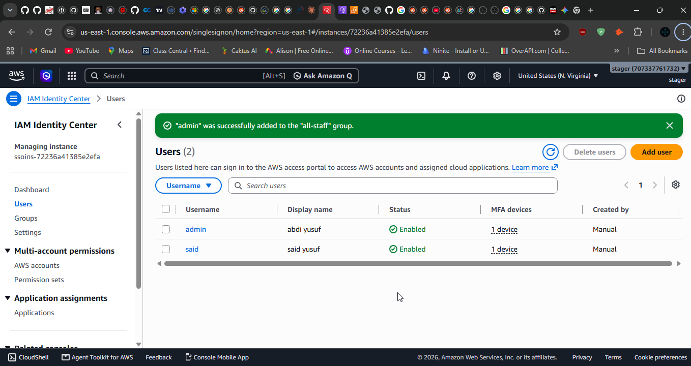
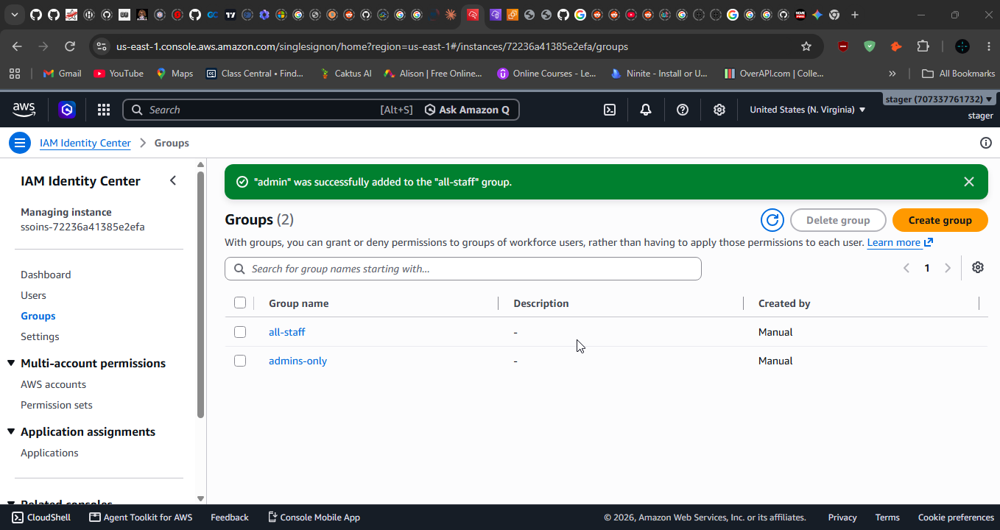

# BUILD-LOG  Zero Trust Remote Access Gateway on AWS

**What was built, how, and why every piece exists.** For the plain-language, analogy-driven walkthrough of how everything connects, read **[CONCEPTS.md](CONCEPTS.md)** first or alongside this  it's the companion piece

Region: `us-east-1` · Built entirely through the AWS Console · Domain: `sinosomtechnology.qzz.io`

## How to read this

This isn't the checklist  that's the plan document. This is the explanation, in this order:

1. The problem this project answers
2. One request, told end to end, before any AWS service is named
3. The building blocks (short technical reference  see CONCEPTS.md for the deep intuition)
4. The build, in order, with the reasoning behind every non-obvious choice
5. The bug  one genuine failure, documented in full
6. Proof, cost, limitations, glossary

---

# PART 1  The problem

## How remote access normally works

Internal systems  an admin dashboard, a database console, a finance tool  sit on a private network with no direct door to the outside. Staff reach them via VPN: authenticate once, and the laptop becomes, network-wise, indistinguishable from a machine physically on-site.

That model has two structural problems, not configuration mistakes.

**Problem one: authentication happens once, at the edge.** The VPN checks who you are at connection time and never again. Six hours later, traffic is still trusted based on a decision made at 9 AM. Nothing re-verifies the account hasn't been disabled, the laptop hasn't been compromised, or that this specific request to this specific system is something this person should be doing.

**Problem two: the unit of access is the network, not the application.** The VPN doesn't grant access to "the finance tool"  it grants access to whatever network segment the finance tool happens to live on, which also holds the admin dashboard, the database, and the forgotten test box nobody's patched since 2019. Access control then has to be reimplemented *inside* the network by dozens of separate, inconsistent mechanisms. This is what enables **lateral movement**: a stolen low-value credential becomes a foothold, and the foothold becomes a path to everything else on the same segment.

The shorthand is **castle and moat**  a hard wall, a soft trusting interior. One credential collapses the entire model.

## What Zero Trust means

> Never trust something because of where it is on the network. Verify identity and authorization on every request, for every resource, independently.

Two pieces of vocabulary from **NIST SP 800-207**, the standard defining this model:

- **PDP (Policy Decision Point)**  evaluates "should this identity be allowed to do this?"
- **PEP (Policy Enforcement Point)**  sits in the traffic path, asks the PDP, forwards or blocks

**This entire project is one PEP/PDP pair built in front of two applications.** Everything below is the mechanics of making that real.

## What actually had to be proven

Three things, none optional:

1. A user who **should** have access gets in.
2. A user who **should not** is **denied**  a hard `403`, not a hidden button.
3. **Both events land in a log**, with identity, timestamp, decision.

A control you can't prove denies is a hope, not a control.

---

# PART 2  One request, start to finish

said opens a browser, types `https://general.ztlab.sinosomtechnology.qzz.io`.

**Step 1  DNS.** The name resolves to a Verified Access endpoint, not the application. The application has no public address at all.

**Step 2  TLS.** AWS presents a certificate for `*.ztlab.sinosomtechnology.qzz.io`. The browser verifies it's signed by a trusted authority  proof this is genuinely the endpoint, not an impostor.

**Step 3  the checkpoint asks who's there.** No session exists yet, so Verified Access redirects to IAM Identity Center.


**Step 4  identity.** said authenticates.


**Step 5  MFA.** A second factor is demanded, not offered.


**Step 6  Identity Center answers one question only.** Who is this, and what groups do they belong to  `all-staff`. It says nothing about whether said may enter *this* application. Authentication and authorization are answered by two different systems, on purpose.

**Step 7  the Policy Decision Point evaluates.** Two policies apply, and both must independently say yes: the **group-level** policy (shared by every endpoint in the group) and the **endpoint-level** policy (specific to this one application). For said reaching the general app, both require `all-staff`, both pass.

**Step 8  only now does traffic move inward,** through the internal load balancer, to the instance.


The decision happens **before** the connection. The application never sees an unauthorized request  it never hears from them.

**Step 9  logged.** Every decision, allowed or denied, lands in CloudWatch.

**Step 10  said tries the admin app**, same session, no new login. Identity is already established, but authorization runs fresh: the admin endpoint requires `admins-only`. said isn't a member. Denied.


**This one screenshot is the thesis of the project.** said is authenticated, MFA-verified, and by any network definition already "inside." It buys nothing. Access to one application conferred zero access to the other, because the applications never shared a trust boundary  only plumbing.

**Step 11  logged too.** A denial nobody records is invisible, and denials are often the more valuable signal.

---

# PART 3  The building blocks (technical reference)

*For the intuitive version of everything below, with a running analogy connecting every piece to every other piece, see CONCEPTS.md. This section is the compact technical definitions.*

## VPC and subnets

**`ZeroTrustLab-VPC`, `10.1.0.0/16`.** A private, isolated address space. `10.x` is an RFC 1918 private range  not routable on the public internet by definition, before any firewall exists. `10.1` rather than `10.0` (used by the prior project) avoids any future address collision if the two were ever connected.


Three subnets, each in exactly one Availability Zone:

| Subnet | CIDR | AZ | Purpose |
|---|---|---|---|
| `ZeroTrustLab-App-Subnet` | `10.1.1.0/24` | `us-east-1a` | The two application instances |
| `ZeroTrustLab-LB-Subnet` | `10.1.2.0/24` | `us-east-1a` | Load balancer, AZ 1 |
| `ZeroTrustLab-LB-Subnet-2` | `10.1.3.0/24` | `us-east-1b` | Load balancer, AZ 2 |

The second load balancer subnet wasn't planned  AWS requires an ALB to span **at least two AZs**, a hard platform rule tied to what a load balancer's job actually is (staying reachable even if one data center has a problem).

## Route tables

A lookup list: `destination → target`. The one entry that matters most here is what's **absent**: the App subnet's route table has no `0.0.0.0/0` entry pointing at an Internet Gateway. There is no route out, and therefore structurally no route in  a stronger property than a blocking rule, because a missing route can't be misconfigured into existing.


## Security groups

Stateful, default-deny firewalls attached to a resource's own network interface, not a shared chokepoint.

**`ZeroTrustLab-App-SG`**  inbound HTTP(80) and HTTPS(443) from `10.1.0.0/16` only (the whole VPC, never the internet). HTTPS was added mid-build once the SSM VPC endpoints (below) turned out to need port 443, which the original rule didn't cover.


**`ZeroTrustLab-ALB-SG`**  inbound HTTPS(443) from `10.1.0.0/16` only.


`0.0.0.0/0` appears in no inbound rule anywhere in this project  not on the instances, not on the load balancers.

## EC2  the applications

Two instances: `ZeroTrustLab-GeneralApp` (low sensitivity) and `ZeroTrustLab-AdminApp` (high sensitivity). Deliberately trivial  one line of HTML each  because nothing about this project's claims depends on what the applications do; the boundary being tested lives entirely outside them.

Launched with **no public IPv4 address**. No host on the internet can address them, port-scan them, or find an SSH daemon to attack, because none of that surface exists.


**Administering a server with no public IP:** AWS Systems Manager Session Manager. The agent on the instance connects *outward* to AWS and waits  no inbound port, no SSH key, authentication via IAM identity, and every session automatically logged in CloudTrail as a `StartSession` event. For the agent to reach Systems Manager without general internet access, three **interface VPC endpoints** were created (`ssm`, `ssmmessages`, `ec2messages`)  private network paths to those specific AWS services that never touch the public internet. Deleted after verification; they bill ~$0.01/hr each.

## Load balancers

An **Application Load Balancer** operates at Layer 7 (HTTP-aware)  required because Verified Access's HTTP(S) endpoint type needs to work with browser redirects and per-request evaluation, which a Layer-4 Network Load Balancer can't see at all.

**Scheme: Internal  the single most consequential dropdown in the build.** Internet-facing would have given the ALBs their own public addresses, reachable directly by anyone who found the DNS name  completely bypassing Verified Access. Internal means the ALB is only reachable from inside the VPC, so the Verified Access endpoint is the *only* path in. A control that can be routed around is not a control.


**Target groups** hold the list of actual servers and the health-check rules. The ALB doesn't route directly to instances  it routes to a target group, which routes to instances, so one ALB can serve many applications through different target groups if needed. "Healthy" here proves the applications were genuinely serving content, independent of any access decision  removing ambiguity from later test failures.


TLS is terminated at the ALB; the final hop to the instance is plain HTTP, inside a private subnet with no internet route and security groups permitting only the ALB's traffic. Accepted here; a stricter environment would re-encrypt that hop too.

## DNS and TLS

`sinosomtechnology.qzz.io`, DNS hosted at DigitalPlat rather than Route 53  a valid arrangement, since AWS only needs the ability to create records, not to host the zone itself. Subdomains `general.ztlab...` and `admin.ztlab...` group this project's names under one branch purely for organizational clarity.

**ACM Certificate Manager** issued one public certificate covering both subdomains as Subject Alternative Names, validated via DNS  a unique CNAME record proving domain control, since a Certificate Authority won't sign for a name you don't control. ACM certificates are free, region-specific (which is why the region stayed constant throughout), and renew automatically as long as the validation record stays in place.


## IAM Identity Center

The identity provider: users, groups, membership, MFA enforcement.




Policies reference **groups**, never individual users  onboarding and offboarding become single membership changes rather than policy edits, and "who can reach the admin app" has one authoritative answer: the membership list of `admins-only`.

MFA is enforced, not optional  a stolen password alone is no longer sufficient, because the attacker also needs the physical second-factor device.

**The boundary that matters:** Identity Center answers "who is this" and stops. It never answers "may they enter this specific application"  that's Verified Access's job entirely, and the separation means either system can be swapped without touching the other.

## AWS Verified Access

Four components:

**Trust provider**  tells Verified Access where to source verified identity from. Type: IAM Identity Center.


**Instance**  the running service itself, the actual Policy Enforcement Point, and where logging is configured.

**Group**  a container multiple endpoints can belong to, carrying shared policy. `ZeroTrustLab-Group` holds a baseline rule intended to apply everywhere. **This is where the Part 5 bug lived.**


**Endpoints**  the actual checkpoint per application. Each holds its own domain, certificate, attached load balancer, and Cedar policy.


**One endpoint per application is the entire design.** It's the structural expression of "access is granted per resource, never per network"  and it bills ~$0.27/hour per endpoint, no free tier, which shaped the entire build schedule.

### Cedar, the policy language

```cedar
permit(principal, action, resource)
when {
    context.idc.groups has "<group-id>"
};
```

`context` carries everything Verified Access knows about the request  identity claims from the trust provider. `.groups has "..."` tests for a group **ID**, not a name  deliberately, since names are mutable and a rename would silently break every policy referencing the old one. The cost of that safety is human readability: two structurally identical policies differing only in a 36-character hex string look the same at a glance, which is exactly what made Part 5's bug hard to see.

**Cedar is default-deny**  no matching `permit` means deny, always. And critically: **when both a group policy and an endpoint policy exist, both must independently permit.** They're evaluated separately and ANDed, not merged, and nothing in the console visually indicates this when you're looking at just one of the two pages.

## CloudWatch Logs

Every access decision  who, when, which application, allowed or denied  delivered here.

A control that enforces but doesn't record can't be investigated or proven to have worked. Denials are the higher-value half of the data: a pattern of repeated denials against a sensitive app from a valid account is one of the cleanest signals of a compromised credential.

---

# PART 4  The build, in order, and why that order

Two constraints drove the sequence: **dependency** (some things can't exist before others) and **cost** (Verified Access bills from creation, no free tier). The resulting rule: build everything free first, verify it works, create billing resources last, test immediately, tear down immediately.

## Phase 0  Safety net

Confirmed the zero-spend AWS Budgets alert from the previous project was still active, and confirmed region was still `us-east-1`. A budget alert defends against the actual failure mode  forgetting, not overspending on purpose.

## Phase 1  Network

Created `ZeroTrustLab-VPC` and its subnets. A **new** VPC rather than reusing the previous project's, for three reasons: independent blast radius if something goes wrong, clean teardown with no risk of removing something another project depends on, and the project standing alone in its documentation without requiring context from elsewhere.

## Phase 2  Applications

Security group first (so the instance is protected from the moment it boots, not briefly exposed while being configured), then an IAM **role** (`ZeroTrustLab-SSM-Role`, `AmazonSSMManagedInstanceCore`  narrow, granting exactly what the SSM agent needs and nothing broader), then the three SSM VPC endpoints, then the instances  launched with auto-assign public IP disabled and no key pair, since SSH plays no role in this architecture at all.

## Phase 3  Identity

Enabled Identity Center, created two users and two groups, assigned membership, enforced MFA. Built before policies, since policies reference group IDs that don't exist until the groups do.

The membership design at this point:

| User | Groups |
|---|---|
| said | `all-staff` |
| admin | `admins-only` |

This table contains the seed of the coming bug  worth holding the question "what happens to admin if a policy anywhere requires `all-staff`" in mind, since it wasn't visible at the time.

## Phase 4  Domain and certificate

One ACM certificate covering both subdomains, validated via manually-added DNS records in DigitalPlat, confirmed **Issued**  done before the load balancers exist, since an unissued certificate doesn't appear in the ALB creation dropdown at all, and validation timing is unpredictable enough that it's better to wait for free than wait while two ALBs are already billing.

## Phase 5  Load balancers

Second-AZ subnet, then `ZeroTrustLab-ALB-SG`, then target groups (required before the ALB, since the ALB's default action needs somewhere to point), then the ALBs.

The choices that actually mattered:

| Field | Chosen | Why |
|---|---|---|
| Type | Application | Layer 7, required by Verified Access's HTTP endpoint type |
| **Scheme** | **Internal** | **Internet-facing would have bypassed every access control entirely** |
| Mappings | Both AZs | AWS's two-AZ minimum |
| Security group | `ZeroTrustLab-ALB-SG`, default removed | Security groups are additive  leaving a permissive default attached alongside a scoped one means the permissive rules still apply |
| Listener | HTTPS:443 | Matches what Verified Access forwards |

Billing started the moment the first ALB went Active. Target group health was confirmed before proceeding  the checkpoint that meant any later failure could be attributed confidently to the access layer, not a broken app.

## Phase 6  Trust provider, instance, group

Free to create; billing begins at endpoint association, so maximum configuration was front-loaded here. A policy was attached at the group level, intended as a baseline "must be a real employee" gate. **This is the policy that turned out to be the bug**  correct by intention, wrong by reference.

## Phase 7  Policies

Both endpoint policies written and syntax-checked before any endpoint existed  policy authoring is the slowest, most iterative part of this kind of work, and doing it while two endpoints bill at $0.54/hr means paying for thinking time. The general rule: when something bills per hour, move every decision you can *before* it exists, so the expensive window contains only actions, never deliberation.

## Phase 8  Endpoints live

Both endpoints created, attached to their ALBs, policies attached, DNS CNAMEs pointed at the AWS-generated endpoint domains. This is the moment the architecture became real, and the moment the expensive clock started properly.

## Phase 9  Proof

**Test 1  said, general app, should succeed:**


Full chain confirmed: redirect → login → MFA → application loads. Every layer worked, in order.

**Test 2  said, admin app, should fail:** covered fully in Part 2  the `403` that's the actual thesis of the project.

**Test 3  admin, both apps, should succeed:** this one failed, and produced Part 5.

---

# PART 5  The bug: two locks on one door

## Expected vs. actual

admin is a member of `admins-only`. The admin endpoint's policy requires `admins-only`. Expected: access granted. Actual: **403 Unauthorized**  the same denial said correctly received, now from a user in the right group.

## The debugging

**Step 1  confirm the evidence is actually the right evidence.** The first round of "admin was denied" screenshots turned out, on inspection, to be said's session  correct behavior, not the bug. This is worth stating plainly because it's the most common failure in real incident work: debugging the wrong event produces confident conclusions about a problem that isn't there. Check the identity in the screenshot before theorizing about a cause.

**Step 2  check group membership before policy logic**, per the plan's own troubleshooting order: membership is a fact with one unambiguous answer, checkable in ten seconds; policy logic is interpretation that can absorb an hour. Checked directly against the group's own member list, not the user's profile page. Membership was correct. Move on.

**Step 3  read the endpoint policy directly.** It required the `admins-only` group ID. Correct.

At this point every piece known about was correct, and the outcome was still wrong  which is the actual signal the *model* of the system was incomplete, not that some detail was off. Something was participating in the decision that wasn't on the list of suspects.

**Step 4  the missing piece, confirmed against AWS documentation:**

> If a Verified Access group has a policy **and** the endpoint has a policy, **both** must independently allow the request.

Not "either." Not "more specific wins." Both, evaluated separately, ANDed.

**Step 5  read the group policy.** It required group ID `c4f86418-...`. The `admins-only` group ID is `b4080488-...`. Different. The group-level policy was actually requiring **`all-staff`**  written in Phase 6 as a general "must be a real employee" baseline, without accounting for the fact that it would apply as a hard prerequisite to the admin endpoint too.

## The full picture

Both endpoints belong to `ZeroTrustLab-Group`, so every request to either app passes the group policy first:

| | Group policy (`all-staff`) | Endpoint policy | Result |
|---|---|---|---|
| said → general | pass | pass | ✅ allowed |
| said → admin | pass | fail | ✅ denied |
| admin → general | pass | pass | ✅ allowed |
| admin → **admin** | **fail** (admin wasn't in `all-staff`) | never reached | ❌ **wrongly denied** |

admin was failing at a gate nobody was inspecting, one layer before the gate everyone was staring at. The endpoint policy  the entire focus of the investigation  was correct the whole time.

## Why it was genuinely hard to see

The console shows group policy and endpoint policy on separate pages with no indication either affects the other. Both failure modes produce an identical `403`, carrying no information about which gate refused. The evidence pointed at the user (worked for said, not for admin), which pulls attention toward user-specific configuration  which was, in fact, fine. Group IDs are opaque hex strings, indistinguishable at a glance; had the policies read `all-staff` and `admins-only` in plain text, the mismatch would have been visible in one second. And the original intention  "everyone must be an authenticated employee"  was entirely reasonable; the mistake was implementing "authenticated employee" as membership in a group that not all employees actually belonged to.

## The fix, and the choice behind it

Two valid options: add admin to `all-staff` as well, or remove the group-level policy entirely so each endpoint's own policy is the sole gate.

**Adding admin to `all-staff` was chosen**, because it matches the original intent (admins are staff; the group should have included them from the start), preserves a genuine defense-in-depth layer (the group policy still catches anyone who somehow isn't a real employee at all, even if a future endpoint policy is written too permissively), and is the cheaper, lower-risk operation  a membership change with an unambiguous result, versus editing live policy on a billing system.

**The semantic correction that's the real lesson:** `all-staff` means *"is a legitimate employee at all,"* and `admins-only` means *"additionally holds elevated rights."* These are **layered**, not **parallel alternatives**  and the original membership model had quietly assumed they were alternatives.

## The second gotcha: stale sessions

Adding admin to `all-staff` alone wasn't sufficient. **An already-issued session carries the group claims it was issued with**  Verified Access received admin's groups at sign-in and cached them for the session's lifetime. Changing membership in Identity Center does nothing to a session that already exists. The fix required a full sign-out, a fresh incognito window, and re-authentication before the new membership appeared in the context Cedar evaluates. Without knowing this, the fix looks like it failed.

This generalizes: **identity changes take effect at the next authentication, not immediately**  the same reason revoking someone's access doesn't always kill their currently active session, a genuine and widely underappreciated operational concern.

## Result, after the fix


Every cell in the earlier table is now correct, and correct for the intended reason  the actual distinction between a system that works and a system that happens to produce right answers.

## What this bug is actually worth

More than the rest of the build. The happy path demonstrates that instructions were followed. This demonstrates reading a denial correctly, verifying evidence before theorizing, triaging cheap checks before expensive ones, recognizing that "everything I can see is correct" means the model is incomplete, finding the real behavior in documentation rather than guessing, and understanding why the console made it invisible.

It's also, specifically, a **quiet misconfiguration that failed closed**  the safe direction. The mirror image  a group policy more permissive than intended, silently widening access past what each endpoint policy appears to allow  would have produced no error at all, no symptom, while every individual endpoint policy read correctly to anyone auditing them. That asymmetry is why this gets written up at length instead of fixed quietly.

---

# PART 6  Proof, mapped to what each piece actually establishes

| Evidence | Proves |
|---|---|
| VPC + route table (no `0.0.0.0/0` to an IGW) | Internet unreachability is structural, not a rule |
| EC2 instances, empty Public IPv4 column | No internet-addressable surface exists at all |
| Security group rules | Scoped to the VPC range only; no `0.0.0.0/0` anywhere |
| ALBs, Scheme: internal | No bypass path exists around Verified Access |
| Target groups healthy | Apps were genuinely serving traffic  later failures are access decisions, not broken apps |
| Certificate issued, DNS pointing at endpoints | Public DNS resolves to the checkpoint, never to the app or the load balancer |
| said allowed → general, denied → admin | **The thesis**: authentication doesn't equal authorization; access is per-resource |
| admin allowed → both | The layered group model, working correctly after the fix |
| CloudWatch allow + deny entries | Every decision, including refusals, is recorded and auditable |

The four decisive results together  said allowed to general, said denied to admin, admin allowed to admin, admin allowed to general  are what prove *discrimination*, not coincidence. An allow alone proves nothing (a broken-open system produces it too); a deny alone proves nothing (a broken-closed system produces it too). Only the full matrix, correct in every cell, proves the system is actually making resource-specific decisions.

---

# PART 7  Logging

Verified Access was configured to deliver decision logs to CloudWatch Logs during Phase 6, before anything went live  logging enabled after the fact captures nothing retroactively; the events either were recorded or they're gone.


A production version would add metric filters and alarms on denial patterns, log archival to S3 with object lock, and shipping to a SIEM for correlation with other signals  a Verified Access denial next to a simultaneous impossible-travel alert from the identity provider is far more meaningful than either alone.

---

# PART 8  Cost, and why it shaped the build

| Resource | Rate | Status |
|---|---|---|
| VPC, subnets, route tables, security groups, IAM, Identity Center, ACM | $0 | Free indefinitely |
| EC2 t2/t3.micro | Free tier | Free within monthly limits |
| Interface VPC endpoints (×3) | ~$0.01/hr each | Deleted after use |
| Application Load Balancers (×2) | ~$0.0225/hr each | Deleted after testing |
| **Verified Access endpoints (×2)** | **~$0.27/hr each + per-GB** | **Deleted immediately after testing** |

$0.54/hr sounds trivial and isn't, left running  roughly $390/month, indefinitely, if forgotten. That's the actual shape of real cloud cost incidents: not deliberate overspend, forgotten resources.

The discipline that followed: every free resource built and verified first, policies written before the resources they'd attach to existed, billing resources created last as one batch, tested immediately, torn down immediately, with an independent budget alert running the entire time as a backstop against the discipline itself failing.

**Teardown order  by burn rate, not dependency:** Verified Access endpoints first (most expensive), then instance/group/trust provider, then both ALBs, then the three SSM interface endpoints (small, and the easiest to forget precisely because they're small), then the EC2 instances.

---

# PART 9  Limitations, honestly

**No device trust.** Real Zero Trust evaluates the device alongside identity  patch level, disk encryption, EDR presence. This build used identity only; a valid identity on a fully compromised laptop passes every check here.

**No continuous re-evaluation within a session.** Policy runs per request, already far better than a VPN's once-per-connection  but a session's claims stay valid for its lifetime, which is the same property behind the stale-session issue in Part 5.

**Single-AZ applications.** The ALBs span two AZs because AWS forced it; the instances don't. Resilience was explicitly out of scope.

**No WAF.** Verified Access decides *who* may reach the application, not *what* they send. Content-layer attacks (injection, XSS) aren't addressed here.

**Unencrypted final hop**, acceptable inside a private VPC, not for a stricter zero-trust-to-the-host posture.

**Entirely console-built.** Deliberate, to understand the system before automating it  but a production version belongs in Terraform, where the Part 5 bug would likely have been visible in code review, with the group policy and both endpoint policies sitting in one file on adjacent lines.

**Trivial applications, two users, two groups.** Correct for isolating the security boundary under test; not representative of real application complexity or real organizational access sprawl.

**What comes next:** Infrastructure as Code, device trust, WAF, real alerting, multi-AZ applications, end-to-end TLS, more granular policy conditions, and a documented break-glass path for when the identity provider itself is unavailable.

---

# PART 10  Glossary

**ACM**  AWS Certificate Manager; issues and auto-renews free TLS certificates.
**ALB**  Application Load Balancer; Layer 7, HTTP-aware.
**Availability Zone**  a physically separate data center within an AWS region.
**Cedar**  AWS's policy language, used by Verified Access.
**CIDR**  address-block notation; smaller number after the slash = bigger block.
**Default-deny**  anything not explicitly permitted is refused; the safe failure direction.
**IAM Role**  an identity a *resource* assumes, with temporary auto-rotating credentials; distinct from an IAM User, which a person signs into.
**Interface VPC Endpoint**  a private network path to a specific AWS service, never crossing the public internet.
**Internal (load balancer scheme)**  reachable only from inside the VPC.
**Lateral movement**  an attacker expanding from an initial foothold to other systems on the same network.
**PDP / PEP**  Policy Decision Point / Policy Enforcement Point.
**Security group**  a stateful, default-deny firewall attached to a resource's own network interface.
**Session Manager**  IAM-authenticated shell access with no inbound port and no SSH key.
**Target group**  the set of servers a load balancer forwards to, plus health checks.
**Trust provider**  the identity source Verified Access consults for context.
**Verified Access endpoint**  the checkpoint in front of one application.
**Verified Access group**  a container for endpoints carrying shared policy, ANDed with each endpoint's own policy.
**Zero Trust**  never granting trust based on network position; verifying identity and authorization per request, per resource.

---

## CV bullet

> Designed and deployed a Zero Trust remote access architecture on AWS, replacing VPN-style network-level trust with per-application, per-request authorization. Built two private applications behind internal Application Load Balancers with no internet-routable path, fronted by AWS Verified Access endpoints enforcing Cedar policies against MFA-verified identities from IAM Identity Center. Proved the control by demonstrating a fully authenticated user hard-denied a higher-sensitivity application, with both allow and deny decisions verified in CloudWatch Logs. Diagnosed and documented a non-obvious policy-evaluation failure caused by Verified Access group and endpoint policies being independently ANDed. Managed the build under strict hourly-cost discipline, sequencing all free configuration ahead of billed resources and tearing down within the same session.
