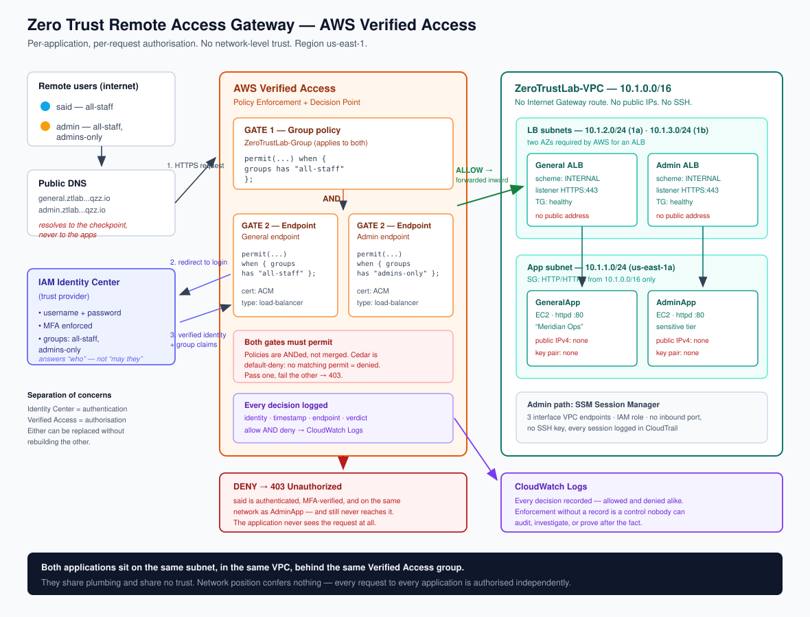

# Zero Trust Remote Access Gateway on AWS

Two private applications on the same subnet, with no internet-routable path to either. In front of each one sits its own independent checkpoint that verifies identity, enforces MFA, and evaluates an authorisation policy **on every request**. Being on the network grants nothing.

The proof is a fully authenticated, MFA-verified user being hard-denied the application they don't have rights to — in the same browser session in which they successfully reached the one they do.

## What this demonstrates

- Per-application, per-request authorisation replacing VPN-style network-level trust
- AWS Verified Access as a Policy Enforcement Point, with Cedar as the policy language
- Identity and MFA delegated to IAM Identity Center — authentication and authorisation kept as separate systems
- Group-based access control using immutable group IDs rather than mutable names
- Internal-only load balancers, guaranteeing no bypass path exists around the access control
- Allow **and deny** decisions verified in CloudWatch Logs
- Strict hourly-cost discipline: all free configuration completed before any billed resource existed, full teardown in the same session

## Stack

AWS Verified Access · IAM Identity Center · Application Load Balancer · VPC · EC2 · ACM · CloudWatch Logs · Cedar — built entirely through the AWS Console, region `us-east-1`

## The proof, in one table

| User | Groups | General app | Admin app |
|---|---|---|---|
| `said` | `all-staff` | ✅ allowed | 🚫 **403 denied** |
| `admin` | `all-staff`, `admins-only` | ✅ allowed | ✅ allowed |

Same network. Same session. Different verdicts — because the decision is bound to the application, not to the network.

## The interesting failure

A user who was in the correct group, against an endpoint policy that named exactly that group, was denied anyway. The cause: a Verified Access **group** policy and an **endpoint** policy are evaluated independently and **both** must permit — a behaviour the console gives no hint of, since the two policies live on separate pages. Full diagnosis and fix in the write-up.

## Full write-up

Every component explained from zero, every decision and why it was made, the full debugging narrative, the evidence and what each piece proves, cost model, and honest limitations: **[BUILD-LOG.md](BUILD-LOG.md)**